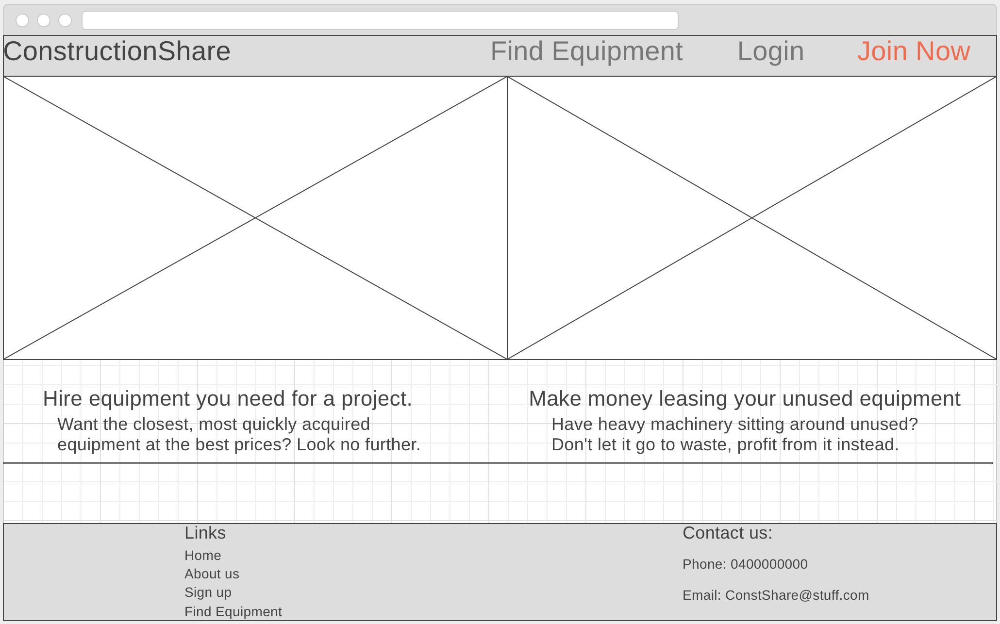

# Construction equipment online

## Table of Contents

* Problem Definition
  * Unfulfilled need
  * Problems with existing sites.
  * Growing demand
* Solution
* Technology
* User Stories
  * Preliminary User Stories
  * Detailed User Stories
* Workflow
* Planning
  *User flow
  *ERD
* Style Guide
  * Font 
  * Colours
* Wireframes
* Outstanding Issues

-------------------
## Problem

There is a unfulfilled need for an online peer to peer construction equipment leasing website. There are many sites of individual, local leasing companies, but none are peer to peer.  

This can leave renters in limbo finding conveniently located equipment because individual leasing companies may not be close, while their neighbour one km away, may have what you need.  
 
Traditional renting also comes with higher rental costs than what peer to peer leasing could provide.  
And if you're a potential or existing equipment owner, you have limited options to make use of idling equipment, which can make ownership uneconomical. 

The construction lending market is expanding significantly increasing the demand for equipment, while an increasing  potential supply of inventory in the form of left-over equipment from completed projects, is promoting a great demand for a peer to peer construction equipment platform.  Globally, there is only one company really providing this and they are only in a handful of local markets mostly in the US.

## Solution

Create a peer to peer, construction leasing/lending website that can meet the ever-increasing demand for equipment and harness the growing supply of left-over equipment, making equipment ownership economical, and sustainable.  
For lessees, this solution will untap latent inventory,  enabling increased return on assets.  For lessors, it will provide increased equipment choice, locational convenience and a potentially more affordable solution, in a one-stop shop with national, if not global scope.  

## Links

  [My site at Heroku](https://constructshare.herokuapp.com)  
  [Link to github](https://github.com/Caseykm/constructshare)
  [My Trello page](https://trello.com/b/0BcEH8sk/two-sided-marketplace) 

## Technology used:

* Ruby on Rails, HTML, CSS, Bootstrap, Github, Heroku

## Preliminary user stories
|
|---
|As a property developer, I want to find equipment near me to build my project.  
|As a construction worker, I want to see a map that shows all available equipment that is available for use.    
|As a builder, I want to be able to search for equipment within my area.
|As a user, I want to be able to enter my personal details.
|As a prospective lessor, I want to be able to register as a borrower.  
|As an equipment owner, I want to be able to list my unused equipment for rental.  
|As a equipment owner, I want to be able to register as a borrower.  
|As a user I want to be able to have a convenient method of payment.  
|As a lessee, I want to be able to list multiple products to rent.  
|As a lessor, I want to be able to return the leased equipment conveniently.  
|As an equipment owner, I want my wares to be find
|As a lessor/lessee, I want the equipment to be able to be booked for multiple days. 
|As a user, I want to be able to send messages to other users.  
|As a vendor, I want to be able to indicate the area of equipment availability. 
|As borrower, I want to be able to search for product so that I can find what I want and compare prices.
|

# Detailed user stories
*As a user I can create a personal profile.*  

**Feature:** Profile creation 

As a user I can create a profile.

User should be able to enter data to customise their profile.

User should be able to do this securely.

*As a User I want nobody other than me to be able to edit my profile*

Because I want to have control over my profile details.

Given someone else tries to edit my details, listings or bookings,

They are redirected back to their homepage.

*As a User I want to search for nearby equipment*

Because it will be convenient for me.

Given I search for something, nearby options are returned.

*As a User I wish to list my stuff and provide details*

Because it will help me rent my things.

Given I click to make a new listing, fields are given to enter data and data is marketed to latent customers.

*As a User I want to be able make an online payment*

Because I do not want to deal in cash.

Given I make a booking, I can have an online payment option.

*As a User I want to be able to view pictures of the equipment*
Because it will allow me to see what I am renting.

Given I search for stuff, I can see pictures of those things.

# Planning
I have attempted to plan how the user would navigate around the site.  My initial plan is shown below and is what the project was loosely based around.  

My ERD diagram is shown below. It has changed many times over the build process and further changes will come in the near future.  

# Style guide
 
As a company that deals in tools and construction it is important to convey strength, stability and reliability to our users. A Sans serif font would best fit this ideal as they are a bold no-nonsense design providing a sense of substance and strength.
To this end Neue Helvetica eText was identified as the optimal candidate. 
In the 80's Helvetica was updated to Helvetica Neue to make the font more current.  
More recently, Neue Helvetica etext was developed which is, 

*"specifically tailored for the text-heavy environments of e-readers, tablets, mobile devices, and the web. Neue Helvetica eText consists of four weights with corresponding italics, all designed and optimized to enhance the reading experience at the smaller point sizes that contemporary web and device environments call for."*

# Colours

I want to use colours relating to the construction industry.  The colours below that I have chosen are not too different from many other related sites.

# Wireframes
I tried to create wireframes that would make ease of navigation for the customer easy. 

## Outstanding Issues

All my issues are outstanding, however to name just a few:
  *Colours need work on all views
  *Superfluous code.  Yes there is a lot of it. It isn't super. 
  *Viewing your bookings
  *Booking for more than one day
  *There is no map
  *Owner details/models need fleshing out
  *Let's stop there for my state of mind

[Return to overview](#overview)
